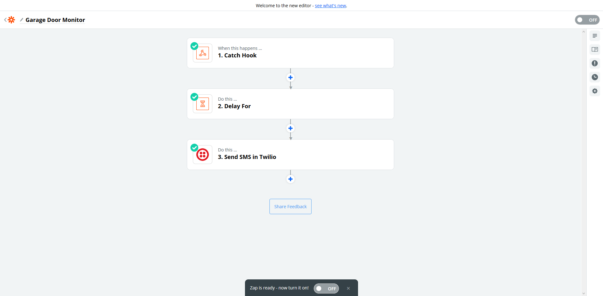
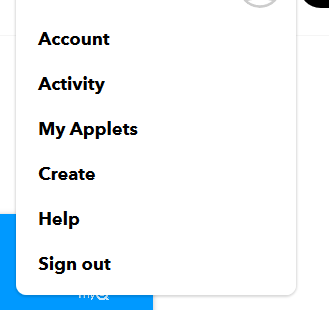
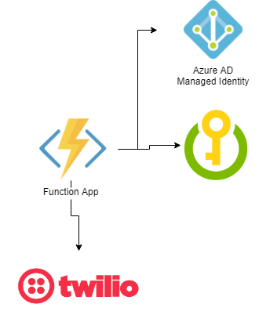

Let's say you have an internet gateway connected to your automatic garage door opener, and setup push notifications for when the door opens/closes. That keeps you informed about your garage door opening and closing no matter where you are. But what happens, when you forget to close it? Neither the app nor the existing recipes on the home automation website [IFTTT](https://ifttt.com) have a way to remind you that you left it open. In fact, my first attempt at solving this problem was to _not_ build something of my own, but instead try to use [Zapier](https://zapier.com), a task automation platform.

**Note**: The source code for this post is available [here](https://github.com/praneetloke/GarageDoorMonitor).

## The First Attempt

My first attempt involved using Zapier. It actually would have worked if there was a way to update a state while waiting for a timer to fire. I did quite a bit of searching before resorting to build something of my own. The first version actually worked quite well. I used IFTTT to connect the myQ service to fire a Webhook request each time the garage door opened or closed. The webhook receiver was a Zapier webhook "catch" action, which I then connected to a timer delay before sending me a text message via Twilio. It mostly worked, except, if I closed the garage door before the timer fires, there was no way for me to update the state and therefore, cancel sending the text message.

Here's the "zap" I ended up creating:



## Durable Functions on Azure Functions

Durable Functions is an extension to the already popular Azure Functions platform. This means, you can write functions with an external trigger (HTTP, Queue etc.) and have it trigger an orchestration. Each orchestration instance is automatically tracked by the platform. Checkout the [API reference](https://docs.microsoft.com/en-us/azure/azure-functions/durable/durable-functions-http-api#http-api-reference) to see what you can control about an orchestration instance.

## Durable Function Types

Learn more about the durable function types [here](https://docs.microsoft.com/en-us/azure/azure-functions/durable/durable-functions-types-features-overview).

### Orchestration Functions

Each function has a trigger type that identifies _how_ that function can be triggered. Orchestration functions are no different. Orchestration functions typically don't do any work other than, you guessed it, orchestrate other functions that do the work.

### Activity Functions

Activity functions are responsible for most of the work in an orchestration. You can make HTTP calls, call other activity functions etc.

### Entity Functions

> Entity functions are only available as part of the Durable Functions 2.x beta. This is in public preview.

Entity functions allow you to represent your orchestration instance with a state. It is up to you on whether each orchestration instance has its own entity or if your state is a singleton. This is controlled by the way that entities are persisted. Each entity is made up of two components:

* An entity name: a name that identifies the type of the entity (for example, "Counter").
* An entity key: a string that uniquely identifies the entity among all other entities of the same name (for example, a GUID).

## IFTTT + Azure Durable Functions + Twilio + Pulumi

Don't be scared by that title. Let's look at the solution I finally ended up with.


* IFTTT receives signals from the garage door opener.
* IFTTT then calls the function app.
* The function app waits for couple of minutes and if the door still isn't closed by then, sends a text message using Twilio.

### IFTTT Applets

IFTTT allows you to create custom applets, which is basically creating your own recipe of "this" and "that". To create a new applet, click your avatar in the top-right corner on https://ifttt.com, and click **Create**.



Click on "+ This" and choose the service called **myQ**. Most of the garage door openers here in the USA are made by the [Chamberlain Group](https://en.wikipedia.org/wiki/Chamberlain_Group) anyway and you are most likely using one of those. All of those openers work with the [myQ](https://www.myq.com/) internet gateway. Your alternative would be to buy a myQ Smart Hub


### Function App

The only external trigger in the function app is the HTTP trigger used in [this](https://github.com/praneetloke/GarageDoorMonitor/blob/master/GarageDoorMonitor/main.cs#L119) function. An orchestration instance is created only through the orchestration client, injected into the HTTP-triggered function as a param.

```c#
[FunctionName("Main")]
public static async Task RunOrchestrator(
    [OrchestrationTrigger] IDurableOrchestrationContext ctx,
    ILogger log)
{
    var delay = Environment.GetEnvironmentVariable("TimerDelayMinutes");
    var delayTimeSpan = TimeSpan.FromMinutes(Convert.ToInt32(delay));
    DateTime timer = ctx.CurrentUtcDateTime.Add(delayTimeSpan);
    log.LogInformation($"Setting timer to expire at {timer.ToLocalTime().ToString()}");
    await ctx.CreateTimer(timer, CancellationToken.None);

    try
    {
        // The use of a critical block, though optional, is recommended here.
        // Updates to durable entities are serial, by default.
        // Having the lock ensures that the entity state we are reading is guaranteed to
        // be the current value of the entity.
        using (await ctx.LockAsync(EntityId))
        {
            var currentState = await ctx.CallEntityAsync<string>(EntityId, "read", null);
            log.LogInformation($"Current state is {currentState}.");
            // If the door is closed already, then don't do anything.
            // This is the main reason for using a custom solution.
            if (currentState.ToLowerInvariant() == "closed")
            {
                log.LogInformation("Looks like the door was already closed. Will skip sending text message.");
                return;
            }
            await ctx.CallActivityAsync("SendTextMessage", null);
        }
    }
    catch (LockingRulesViolationException ex)
    {
        log.LogError(ex, "Failed to lock/call the entity.");
    }
    catch (Exception ex)
    {
        log.LogError(ex, "Unexpected exception occurred.");
    }
}
```

### Deploying the Infrastructure using Pulumi

We will use Pulumi to deploy our function app. The Pulumi app creates the function app along with the Key Vault containing the Twilio account token necessary for the API call to send a text message. For more information, see the README file in the [`infrastructure`](https://github.com/praneetloke/GarageDoorMonitor/tree/master/infrastructure) folder of the source repo.



### Twilio

Make sure you create an account on [Twilio](https://twilio) and purchase a [Programmable SMS](https://www.twilio.com/console/sms/dashboard) number. Your account SID and token can be found on the dashboard page of the [Twilio Console](https://www.twilio.com/console) or on the [Settings](https://www.twilio.com/console/project/settings) page under the **API Credentials** section.

## Final Notes

A few things important things to note:

- Entity functions (part of Durable Functions 2.x) are a preview feature, though, the Durable Function extensions (1.x) themselves is GA.
- The KeyVault in the infrastructure is not necessary for a project like this, but it is very easy to create one with Pulumi. And with Azure's new Managed Identity, it is even easier to configure application access to secrets.
- To learn more about security best practices on Azure, read [this](https://www.pulumi.com/blog/7-ways-to-deal-with-application-secrets-in-azure/) excellent post by [Mikhail Shilkov](https://www.pulumi.com/blog/author/mikhail-shilkov/).
